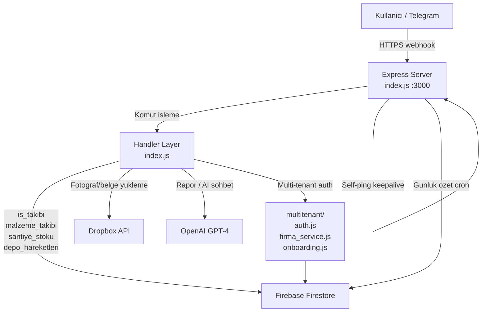

# Construction Site Bot

> **TR:** İnşaat şantiye yönetim botu — Telegram üzerinden günlük iş takibi, malzeme yönetimi, depo akışı ve GPT-4 destekli AI raporlama.
>
> **EN:** A Telegram bot for construction site management — daily work logs, material tracking, warehouse flows, and GPT-4-powered AI reporting.

[](https://nodejs.org)
[](https://firebase.google.com)
[](https://render.com)
[](LICENSE)
[](CONTRIBUTING.md)

---

## Neler Yapabilir? / Features

- **Günlük İş Takibi** — Sahadaki ekiplerin yaptığı işleri Telegram üzerinden kaydet (ekip, mahal, iş kalemi, yevmiye)
- **Malzeme Yönetimi** — Şantiyeye giren/çıkan malzemeleri, stok durumunu anlık takip et
- **Depo Akışı** — Merkezi depodan şantiyeye sevkiyat kayıtları (`depo_hareketleri`)
- **AI Raporlama** — GPT-4 ile günlük/haftalık özet rapor; doğal-dil sorgu ("kaç işçi çalıştı bu hafta?")
- **Fotoğraf Depolama** — Sahadan çekilen fotoğraflar otomatik olarak Dropbox'a yüklenir
- **Excel Çıktı** — `generate-rehber.js` ile kullanıcı rehberi Excel dosyası üretir
- **Çok Firmalı (Multi-tenant)** — Farklı inşaat şirketleri aynı bot altyapısını paylaşabilir, veriler tamamen izole
- **Davet Sistemi** — Patron `/yenifirma` ile şirket kurar; çalışanlara davet linki gönderir
- **Zamanlanmış Görevler** — Her gün sonu otomatik özet bildirimi (node-cron)
- **Render.com Uyumlu** — Ücretsiz tier için self-ping keepalive dahil

---

## Hızlı Başlangıç / Quick Start

> Tüm adımlar 5 dakikada tamamlanır.

```bash
# 1. Repoyu klonla
git clone https://github.com/dgncnakcy/blacksea-construction-bot.git
cd blacksea-construction-bot

# 2. Tek komutla kur
bash setup.sh

# 3. .env dosyasını doldur (açıklamalar için aşağıya bak)
nano .env   # veya tercih ettiğin editörü kullan

# 4. Botu çalıştır
npm start
```

**Windows kullanıcıları:** `bash setup.sh` yerine manuel adımlar:
```cmd
npm install
copy .env.example .env
```

---

## Mimari / Architecture



**Veri akışı:** Telegram mesajı → Express webhook → Handler (index.js) → Firestore yazma/okuma. Foto ekler Dropbox'a; AI sorgu istekleri OpenAI'ye yönlendirilir. Multi-tenant katmanı her sorguya `firma_id` filtresini otomatik ekler.

---

## Konfigürasyon / Configuration

```bash
cp .env.example .env
```

| Değişken | Zorunlu | Açıklama |
|---|---|---|
| `TELEGRAM_TOKEN` | Evet | @BotFather'dan alınır |
| `BOT_USERNAME` | Hayır | Davet linklerinde kullanılır (`your_bot`) |
| `ADMIN_CHAT_ID` | Evet | Onboarding bildirimleri alınacak Telegram ID |
| `DEFAULT_FIRMA_ID` | Evet | Tek-firma veya varsayılan firma slug'ı (örnek: `acme-insaat`) |
| `FIREBASE_CREDENTIALS` | Evet | Service account JSON — tek satırda stringify edilmiş |
| `OPENAI_API_KEY` | Evet | GPT-4 raporlama için |
| `DROPBOX_APP_KEY` | Hayır | Fotoğraf yükleme aktif etmek için |
| `DROPBOX_APP_SECRET` | Hayır | Dropbox OAuth2 |
| `DROPBOX_REFRESH_TOKEN` | Hayır | Dropbox yenileme tokeni |
| `PORT` | Hayır | Varsayılan 3000; Render otomatik inject eder |
| `RENDER_EXTERNAL_URL` | Hayır | Self-ping için Render URL (`https://xxx.onrender.com`) |
| `NODE_ENV` | Hayır | `production` veya `development` |
| `DRY_RUN` | Hayır | Migration script için; `true` = gerçek yazma yok |

Firebase kimlik bilgilerini stringify etmek için:
```bash
node -e "console.log(JSON.stringify(require('./service-account.json')))"
```

---

## Kullanım Rehberi / Usage Guide

### İş Girişi (Şef)

```
Kullanıcı: /is
Bot: Hangi şantiyeye iş gireceksiniz?
     1. Site A
     2. Site B

Kullanıcı: 1
Bot: Hangi ekip çalışacak?
     1. Kalıp Ekibi
     2. Demir Ekibi
     ...

Kullanıcı: 2
Bot: Kaç kişi? (yevmiye)

Kullanıcı: 5
Bot: İş kalemi nedir? (örnek: temel beton dökümü)

Kullanıcı: Temel beton dökümü
Bot: Kayıt kaydedildi. İyi çalışmalar!
```

### Malzeme Ekleme

```
Kullanıcı: /malzeme
Bot: İşlem türü:
     1. Malzeme girişi
     2. Malzeme çıkışı
     3. Stok görüntüle

Kullanıcı: 1
Bot: Malzeme adı?

Kullanıcı: Demir 12 mm
Bot: Miktar ve birim? (örnek: 5 ton)

Kullanıcı: 2 ton
Bot: Demir 12 mm — 2 ton girişi kaydedildi.
```

### AI Rapor Alma

```
Kullanıcı: /rapor
Bot: [GPT-4 günlük özet]
     Bugün 3 şantiyede toplam 18 işçi çalıştı.
     Malzeme: 2 ton demir, 50 çuval çimento.
     Önemli not: Site B'de beton dökümü tamamlandı.
```

### AI Sohbet (Patron/Müdür)

```
Kullanıcı: Bu hafta kaç yevmiye tuttu?
Bot: Bu hafta toplam 112 yevmiye:
     - Site A: 48
     - Site B: 37
     - Site C: 27
```

---

## Multi-Tenant Sistemi

### Yeni Firma Kurulumu

1. Patron Telegram botunu açıp `/yenifirma` yazar
2. Onboarding sihirbazı firma adını, şantiye bilgilerini ve kullanıcı rollerini sorar (10 adım)
3. Tamamlanınca Firestore'da `firmalar/{firma_id}` ve ilk `kullanicilar` dokümanları oluşturulur
4. Patron bir davet linki alır

### Davet Sistemi

Patron tarafından oluşturulan davet linki formatı:
```
https://t.me/your_bot?start=invite_<KOD>
```

Yeni kullanıcı bu linkle bota mesaj atınca otomatik olarak firmayla ilişkilendirilir ve rolüne göre erişim yetkisi verilir.

### Firma İzolasyonu

Her Firestore sorgusu `firma_id` filtresiyle çalışır. `multitenant/firestore_helpers.js` bu filtreyi otomatik ekler. Bir firmanın verisi hiçbir şekilde başka firmaya gözükmez.

### Tek-Firma Mod (Eski Uyumluluk)

`DEFAULT_FIRMA_ID` ile çalışınca eski tek-firma davranışını korur. Mevcut `USERS` sözlüğü compat katmanıyla (`multitenant/compat.js`) desteklenmeye devam eder.

---

## Deployment

### Render.com (Önerilir)

**Otomatik deploy (GitHub Actions):**
1. Render servisini oluştur (Web Service, Node.js)
2. `RENDER_DEPLOY_HOOK` secret'ını GitHub repo'ya ekle (Render Dashboard > Settings > Deploy Hooks)
3. `main` branch'e push yap — GitHub Actions otomatik deploy tetikler

```yaml
# .github/workflows/render-deploy.yml
name: Deploy to Render
on:
  push:
    branches: [main]
jobs:
  deploy:
    runs-on: ubuntu-latest
    steps:
      - run: curl -X POST ${{ secrets.RENDER_DEPLOY_HOOK }}
```

**Manuel deploy:**
```bash
git push origin main
# Render otomatik deploy eder (~5 dk bekle)
```

**Gerekli Render ayarları:**
- Build Command: `npm install`
- Start Command: `npm start`
- Tüm `.env` değişkenlerini Environment sekmesine ekle
- Free tier: `RENDER_EXTERNAL_URL` ayarla (self-ping uykuyu önler)

### Lokal Geliştirme

```bash
npm install
cp .env.example .env
# .env doldur
npm start
# Webhook için ngrok veya benzer bir tunnel gerekli:
# ngrok http 3000
# Telegram webhook'u: /setWebhook?url=https://xxxx.ngrok.io
```

---

## Proje Yapısı / Project Structure

```
construction-site-bot/
├── index.js                    # Ana bot — tüm handler'lar, cron, Express server
├── generate-rehber.js          # Excel kullanıcı rehberi üretici
├── smoke_test.mjs              # Sistem sağlık kontrolleri
├── multitenant/
│   ├── auth.js                 # Kimlik doğrulama, rol kontrolleri
│   ├── compat.js               # Eski USERS dict → Firestore köprüsü
│   ├── firma_service.js        # Firma CRUD
│   ├── kullanici_service.js    # Kullanıcı CRUD
│   ├── santiye_service.js      # Şantiye CRUD
│   ├── invite.js               # Davet kodu üretme/doğrulama
│   ├── invite_handler.js       # Telegram /start invite_<kod> işleme
│   ├── onboarding.js           # Yeni firma kurulum sihirbazı
│   ├── onboarding_questions.js # Onboarding soru seti
│   ├── firestore_helpers.js    # firma_id filtreli sorgu wrapper'ları
│   ├── analytics.js            # Kullanım analitiği
│   ├── migrate.js              # Veri migrasyon aracı
│   └── test_full_flow.js       # Multi-tenant entegrasyon testi
├── seed-*.js                   # Örnek veri seed scriptleri
├── .env.example                # Konfigürasyon şablonu
├── package.json
└── setup.sh                    # Tek komut kurulum
```

---

## Tech Stack

| Katman | Teknoloji |
|---|---|
| Runtime | Node.js 18+ |
| Bot API | Telegram Bot API (HTTP webhooks, Express) |
| Veritabanı | Firebase Firestore (Admin SDK) |
| AI | OpenAI GPT-4 |
| Depolama | Dropbox API (fotoğraflar/belgeler) |
| Excel | ExcelJS |
| Cron | node-cron |
| Hosting | Render.com |

---

## Yol Haritası / Roadmap

- [x] Günlük iş takibi (is_takibi)
- [x] Malzeme ve stok yönetimi
- [x] Depo hareketleri
- [x] GPT-4 AI rapor ve sohbet
- [x] Dropbox foto entegrasyonu
- [x] Multi-tenant mimari (Mayıs 2026)
- [x] Davet sistemi
- [x] Onboarding sihirbazı
- [ ] Web dashboard (planlanıyor)
- [ ] Push bildirim zamanlamaları (patron konfigüre edebilir)
- [ ] İş planı vs gerçekleşme karşılaştırma raporu
- [ ] Mobil-native arayüz (Telegram Mini App)

---

## Claude Code ile Kullanım / Using with Claude Code

Bu repo `CLAUDE.md` içeriyor — Claude Code bu dosyayı otomatik okur ve proje bağlamı hakkında tam bilgiye sahip olur.

```bash
# Claude Code'u proje dizininde başlatmak yeterli
claude
```

`CLAUDE.md` içinde: mimari, anahtar dosyalar, ekleme yapmak için doğru yerler, dikkat edilmesi gerekenler.

---

## Katkı / Contributing

Katkı için bak: [CONTRIBUTING.md](CONTRIBUTING.md)

---

## Lisans / License

MIT — bak [LICENSE](LICENSE)

(c) 2026 Doğancan Akçay
